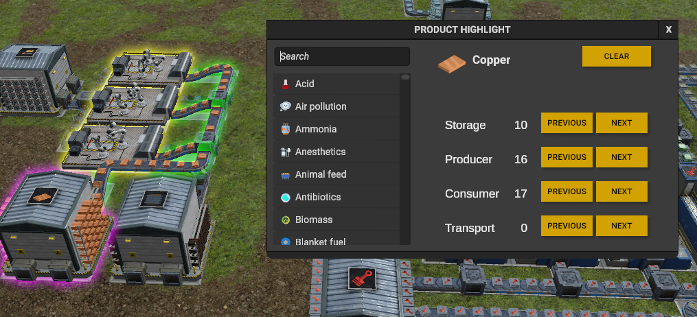

## ProductHighlight

A mod for [Captain of Industry game](https://www.captain-of-industry.com/).

### Features:

	
- Highlight the usage of machines, storage, transport, vehicles from a selected product.
	
	

## Installation

1. Download the latest zip file from the GitHub Release.
2. Extract the zip file to the `%USERPROFILE%\AppData\Roaming\Captain of Industry\Mods` directory.

## Configuration

The Product highlight windows is configured under F7.

The colors used are : 

colorProducer = ColorRgba.White;
colorConsumer = ColorRgba.Yellow;
colorStorage = ColorRgba.Magenta;
colorTransport = ColorRgba.Green;

There is currently no possibility to update these keys/colors

